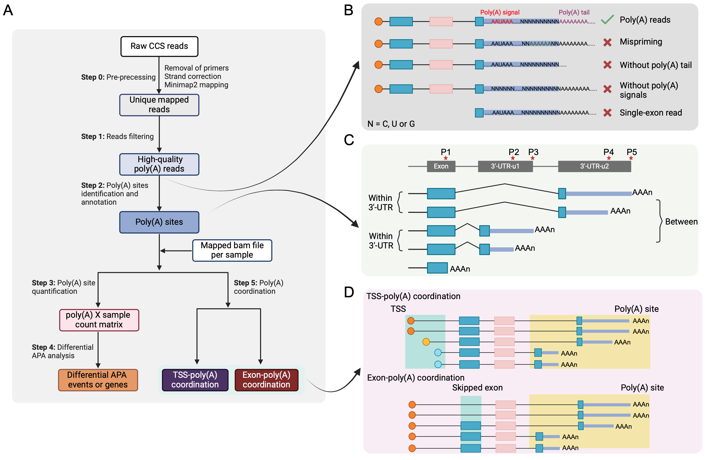
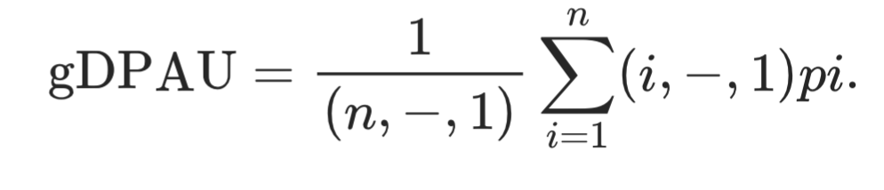
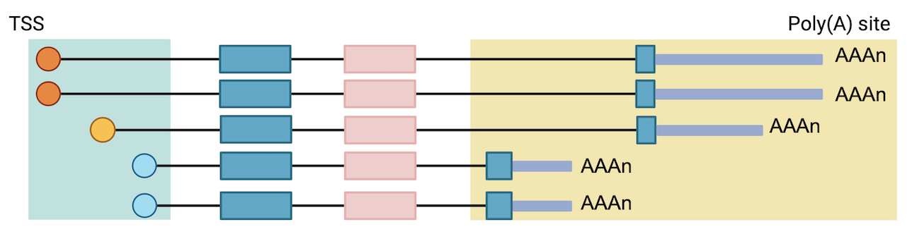

# LRAPA

The pipeline for APA analysis using bulk and single-cell long-read RNA sequencing data.

We would like to construct a data set representing the most comprehensive PAS collection for human brain to date.

Edited in 08/16/2024

**Workflow of LRAPA:**



## Installation 

You can install the package using the following command:

```         
# Clone the repository 
git clone https://github.com/yalanyang/LRAPA_v0.1.git
cd LRAPA_v0.1
# Create and activate a conda environment
conda config --add channels conda-forge
conda config --add channels bioconda
conda config --add channels r

# Install necessary dependencies
conda create -n lrapa -f environment.yml
conda activate lrapa

#in your R session, install these Bioconductor packages:
if (!requireNamespace("BiocManager", quietly = TRUE))
    install.packages("BiocManager")

BiocManager::install(c("rtracklayer", "Rsamtools", "GenomicAlignments", "Biostrings", "DRIMSeq", "plyranges"))

chmod +x lrapa # Make the script executable
```

## **0. Pre-processing of the long-read CCS reads.**

Here, we used one of the three cerebellum samples downloaded from [Pacbio](https://downloads.pacbcloud.com/public/dataset/Kinnex-full-length-RNA/) as test data.

Removal of primers is performed using [lima](https://isoseq.how).

``` shell
lima test.segmented.bam IsoSeq_v2_primers_12.fasta test.fl.bam --isoseq --peek-guess
isoseq3 refine test.fl.IsoSeqX_bc04_5p--IsoSeqX_3p.bam IsoSeq_v2_primers_12.fasta test.refine.bam
```

**Note**: The IsoSeq_v2_primers_12 was download from [Pacbio](https://downloads.pacbcloud.com/public/dataset/Kinnex-full-length-RNA/REF-primers/)

Then we convert the full-length bam file into sam format and run the [flip_reads.py](https://github.com/mortazavilab/ENCODE-references/tree/master) script to orient the reads to the correct strand (since lima\--ccs does not do this, recommend by [Encode long-read pipeline](https://www.encodeproject.org/documents/6d583a1d-d692-4511-b13b-c051822d861c/@@download/attachment/ENCODE%20Long%20Read%20RNA-Seq%20Analysis%20Pipeline%20v3.2%20%28Human%29.pdf)).

``` shell
samtools view -h test.refine.bam > test.refine.sam
python flip_reads.py --f test.refine.sam --o test.fl_flipped.sam
samtools view -bS test.fl_flipped.sam > test.fl_flipped.bam
isoseq3 refine test.fl_flipped.bam PB_adapters.fasta test.flnc.bam
```

**Note**: we didn't trim polyA tails here, because we need to assess whether each read contain a genuine polyA signal based on the length and the base composition of its polyA tail.

We next align the long-reads to the [GRCh38 human reference genome](https://www.gencodegenes.org/human/release_21.html) with Minimap2 using the following parameters:

``` shell
bamtools convert -format fastq -in test.flnc.bam -out test.flnc.fastq
minimap2  -ax splice -uf -C5 $reference/GRCh38.primary_assembly.genome.fa test.flnc.fastq > test.flnc.mapping.sam
samtools view -O BAM -F 2052 -h test.flnc.mapping.sam |  samtools sort -O BAM -@ 7 -o test.flnc.unique.bam -
samtools view -h test.flnc.unique.bam | awk '$10 != "*"' |samtools view -bS - > test.flnc.filter.bam
```

## 1. **Filter long-read reads with polyA signals**

> To identify Iso-Seq reads that capture cleavage and polyadenylation events, we searched for reads that contained stretches of adenosines (i.e., polyA tails).
>
> The poly(A) cleavage site on the genome is considered to be right after the 3′-most position of the alignment of long reads with the genome.
>
> It contains a soft-clipped sequence mostly composed of adenines (or thymines for reverse strand). PolyA stretches needed to be located immediately after the cleavage site (i.e., starts at the base within the read that does not map to the hg38 reference genome, which is otherwise known as the portion of the read that is "softclipped"). We assessed if the softclipped portion of every read contained a stretch of adenosines. We retained the reads if their softclipped segments were \< 20 nucleotides in length and were composed of 95% adenosines. Moreover, if the length of the softclipped segment of a read was ≥ 20 nucleotides, we assessed if the first 20 nucleotides of the softclipped segment was composed of 80% adenosines and if the following 20 nucleotides of the softclipped segment was composed of 95% adenosines and retained these reads as containing a stretch of adenosines.
>
> The flanking region does not contain a stretch of six adenines. Reads with stretches of adenosines were filtered for internal priming or mispriming using an approach similar to what has been described previously. In brief, the genomic sequence −10 to +10 nt surrounding the cleavage site was examined(`-f, --flank_size)`. If the sequence has six continuous As, it is considered as internal priming.
>
> The adjacent region contains a known PAS hexamer. We require the long- read has one of the 12 PAS hexamers (AAUAAA or 11 variants) in −40 to −1 nt region of the cleavage site (`-a, --adjacent_size`).

The 12 PAS hexamers used here are "AATAAA", "TTTAAA", "AAGAAA", "AACAAA", "TATAAA", "AATGAA", "ATTAAA", "AGTAAA", "AATATA", "CATAAA", "ACTAAA", "GATAAA", which is adopted from [our previous study.](https://genome.cshlp.org/content/33/10/1774.full)

``` shell
lrapa filter -i test.flnc.filter.bam -r $reference/GRCh38.primary_assembly.genome.fa -o test.HQ.qname.txt
```

**Parameters**

-   `-i, --input`: Input mapped BAM file (required).
-   `-o, --hq`: Output BAM file (default: "HQ.bam").
-   `-r, --reference`: Reference genome FASTA file (required).
-   `-f, --flank_size`: Flank size on either side of the mapped end position for internal priming (default: 10).
-   `-c, --cores`: Number of cores to use for parallel processing (default: 4).
-   `-a, --adjacent_size`: Flank size to search for PAS signal (default: 40).
-   `-b, --batch_size`: Number of reads to process in each batch (default: 10000).

The script will output a txt file (test.HQ.qname.txt) contained the qname of the reads with ployA signals. Then we extract these reads from the bam file with samtools. The extract reads will be used for PAS identification and annotation analysis in step 2.

``` shell
samtools view -H test.fl_flipped.unique.bam > test.header
samtools view -N test.HQ.qname.txt -o test.HQ.sam test.fl_flipped.unique.bam
cat test.header test.HQ.sam > test.HQ.header.sam 
samtools view -bS test.HQ.header.sam > test.HQ.bam
```

**Note:** Make sure the version of samtools is 1.12 or greater, which accepts option `-N` . If you find that this script needs a lot of memory or very slow you may want to split the input bam file by chromosome (samtools view) and run these separately. We do intend to improve this.

## **2. PAS identification and annotation**

> After obtaining long reads containing poly(A) signals, we identify the poly(A) cleavage site for each read, defined as the last mapped base of the read. Since the cleavage can be imprecise, resulting in mRNAs with variable ends, we refer to the cleavage site as a location where mRNA cleavage takes place, and poly(A) site as a region containing cleavage site(s). Here, due to the inherent heterogeneity of polyadenylation cleavage, we iteratively clustered poly(A) cleavage sites that are within 24 nucleotides of each other.
>
> If a poly(A) site contained a cleavage site annotated in the reference GTF file, the annotated cleavage site is used as the representative poly(A) site. If no annotated site within the poly(A) site, we select the cleavage site with an adenine ("A") base and the highest read count as the representative poly(A) site. If none of the poly(A) cleavage sites are an "A" base, we choose the cleavage site with the highest read coverage as the representative poly(A) site.
>
> **reference**: Bin Tian, Jun Hu, Haibo Zhang, Carol S. Lutz, A large-scale analysis of mRNA polyadenylation of human and mouse genes, *Nucleic Acids Research*, Volume 33, Issue 1, 1 January 2005, Pages 201--212. <https://doi.org/10.1093/nar/gki158>

``` r
lrapa anno -i test.HQ.bam -r $reference/GRCh38.primary_assembly.genome.fa -g $reference/hg38.refGene.gtf -u $reference/hg38.refGene.3utr_merge.bed -o test.PAS.bed
```

**Note:** The hg38.refGene.3utr_merge.bed was generated using the get3UTR_0.1.R script. if you find that this script needs a lot of memory or very slow you may want to split the input bam file by chromosome and run these separately. We do intend to improve this.

**Parameters**

-   `-i, --input`: Input BAM file (required).
-   `-r, --reference`: Reference genome FASTA file (required).
-   `-g, --gtf`: Reference annotation gtf file (required).
-   `-f, --flank_size`: Flank size to search for PAS signal (default: 40).
-   `-u, --utr`: Reference annotation 3'-UTR file (required).
-   `-o, -–output`: Output PAS bed file with header (required).

## **3. PAS count**

### 3.1 Bulk long-read RNA-seq

``` shell
lrapa count -b N1.bam,N2.bam,C1.bam,C2.bam -p test.PAS.bed -o test.PAS.count.txt
```

**Parameters**

-   `-b, --bam_files`: Comma-separated list of input BAM files (required).
-   `-p, --pas`: PAS reference TXT file with BED columns followed by annotations (required).
-   `-o, --output`: Output text file for the count matrix (required).

The output count format:

|                                  | C1  | C2  | C3  | N1  | N2  | N3  | Feature | gene_name |             UTR_id              |       PAS_ID        |
|:-----:|:-----:|:-----:|:-----:|:-----:|:-----:|:-----:|:-----:|:-----:|:-----:|:-----:|
| chr11_35229465_35229470\_+\_3UTR | 16  | 30  | 22  | 12  | 10  |  8  |  3UTR   |   CDC44   | CD44:chr11:35229288:35232402:u2 | chr11_35229470_3UTR |
| chr11_35230014_35230028\_+\_3UTR | 69  | 50  | 54  | 34  | 32  | 22  |  3UTR   |   CDC44   | CD44:chr11:35229288:35232402:u2 | chr11_35230028_3UTR |
| chr11_35232387_35232403\_+\_3UTR | 140 | 160 | 155 | 310 | 440 | 550 |  3UTR   |   CDC44   | CD44:chr11:35229288:35232402:u2 | chr11_35232403_3UTR |

### 3.1 Single-cell long-read RNA-seq

``` shell
lrapa scCount -b scLR.bam -p test.PAS.bed -o RUN3 -w barcode.rev.txt
```

**Parameters**

-   `-i, --input`: Input scRNA-seq BAM file (required).

-   `-p, --pas`: PAS reference TXT file with BED columns followed by annotations (required).

-   `-o, --output`: Output folder for the count matrix (required).

-   `-w, --barcode`: Hitlist barcodes.

## **4. Differential analysis**


### PAS usage index

For genes with two polyA sites, we used DPAU to quantify the percentage of DPAU for each gene. DPAU ranges from 0 to 1.


For genes with more than two polyA sites, [gDPAU](https://www.pnas.org/doi/10.1073/pnas.2113504119) is used to quantify the trend of distal polyA site usage for each gene. It is a location index weighted sum of read count percentage of gene's each polyA site. E.g., for a gene with n (n≥2) polyA sites, p1, p2, ..., pn represent the percentages of its polyA site usage at each site from 5′-end to 3′-end.

{width="479"}

When n = 2, gDPAU = DPAU.

**Reference:**

[Wang J, Chen W, Yue W, et al. Comprehensive mapping of alternative polyadenylation site usage and its dynamics at single-cell resolution[J]. Proceedings of the National Academy of Sciences, 2022, 119(49): e2113504119.](https://www.pnas.org/doi/abs/10.1073/pnas.2113504119)

### 4.1. With replicates

``` shell
lrapa diff -i test.PAS.count.txt -s sample.txt -c case -n control
```

This module performs differential APA usage analyses between exactly two conditions with two or more replicates based the R package [DRIMSeq](http://bioconductor.org/packages/release/bioc/html/DRIMSeq.html). This is done by testing if the ratio of APA changes between conditions.

If a gene's absolute mean difference of DPAU/gDPAU is \>0.1 and adjusted *P* value is \< 0.01 between two groups, the gene's APA change between two groups will be deemed as significant.

**Parameters**

-   `-i, --input`: count file of PAS sites (required).
-   `-s, --sample`: sample information (required).
-   `-c, --group1`: group1 for differential analysis (required).
-   `-n, --group2`: group2 for differential analysis (required).

Example file of sample information

| sample_id,group |
|:---------------:|
|     N1,case     |
|     N2,case     |
|     N3,case     |
|   C1,control    |
|   C2,control    |
|   C3,control    |

### 4.2. No replicates

This module performs differential APA usage analyses between exactly two conditions with no replicate based chisq test. For each test, a n × 2 matrix per PAS site was generated, with the n polyA forming rows and read count in the two conditions forming columns.

We used a Benjamini--Hochberge correction for multiple testing.

If a gene's absolute mean difference of DPAU/gDPAU is \>0.3 and adjusted *P* value is \< 0.01 between two groups, the gene's APA change between two groups will be deemed as significant.

``` shell
lrapa norepdiff -c test.PAS.count.txt -n N1 -g C1
```

**Parameters**

-   `-i, --input`: count file of PAS sites (required).

-   `-c, --group1`: sample 1 for differential analysis (required).

-   `-n, --group2`: sample 2 for differential analysis (required).

    **Note:** The name of sample must same as in the count file.

## 5. Couplings

### 5.1. TSS-PAS coupling



We counted 5ʹ-3ʹ isoforms using GenomicFeatures. Each Pacbio cDNA read was assigned to a TSS in a window of 50 nt and to a PAS. Only the reads that mapped to both features were retained and considered full-length reads. Counts were summarized in 5ʹ-3ʹ isoforms, resulting in counts for each 5ʹ-3ʹ combination.

``` shell
lrapa couplingTSS -i test.mapping.bam -g hg38.refGene.gtf -p test.PAS.bed -o TSS-PAS.coordination.txt
```

TSS: Transcriptional start site

**Parameters**

-   `-i, --input`: Input full-length BAM file (required).
-   `-g, --gtf`: Reference annotation gtf file (required).
-   `-p, --pas`: Reference pas bed (required).
-   `-o, --output`: Output TSS-exon_coordination file.

Reads were filtered to retain only full-length reads: The script will generated a file (full-length.reads.txt) contained the qname of the full-length reads (TSS+TES). Then we get extract the full-length reads from the bam file using samtools, which will be used for PAS-exon coupling analysis.

``` shell
samtools view -H test.mapping.bam > test.header
samtools view -N full-length.reads.txt -o test.full_length.sam test.mapping.bam
cat test.header test.full_length.sam  > test.full_length.header.sam 
samtools view -bS test.full_length.header.sam > test.full_length.bam
```

### 2. Exon-PAS coupling


We quantify the regulatory links between exons and 3ʹ ends. Given that every read represents a full-length transcript, we assessed all features of each read to quantify the frequency of co-occurrence between features using χ2 test.

At this step, we first extract skipped exons from the reference gtf annotation file or assemble transcriptome gtf provided by the users. The exons that are overlapped with other exons and 3'-UTR are removed.

Using this read to feature assignment, we counted the number of reads assigned to a given polyA site and divided them into reads including a particular exon or skipping the exon. Testing for exon--end site coordination were performed using a χ2 test. For each test, a n × 2 matrix per SE was generated, with the n polyA forming rows and inclusion and exclusion counts forming columns. Finally, we used a Benjamini--Hochberge correction for multiple testing and reported the FDR value.

``` shell
lrapa couplingExon -i test.full_length.bam -g hg38.refGene.gtf -p test.PAS.bed -o PAS-exon.coordination.txt
```

**Options**

-   `-i, --input`: Input full-length BAM file, generated by .

-   `-g, --gtf`: Reference annotation gtf file (required).

-   `-p, --pas`: Reference pas bed.

-   `-o, --output`: Output TSS-exon_coordination file.

## File conversion scripts

get3UTR_0.1.R : get the 3'UTR reference for PAS analysis

## **Additional programs**

**References:**

[Alfonso-Gonzalez C, Legnini I, Holec S, et al. Sites of transcription initiation drive mRNA isoform selection[J]. Cell, 2023, 186(11): 2438-2455. e22.](https://www.cell.com/cell/fulltext/S0092-8674(23)00408-7)

[Hardwick S A, Hu W, Joglekar A, et al. Single-nuclei isoform RNA sequencing unlocks barcoded exon connectivity in frozen brain tissue[J]. Nature biotechnology, 2022, 40(7): 1082-1092.](https://www.nature.com/articles/s41587-022-01231-3)
