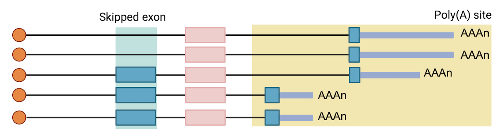

# Couplings

## 1 TSS-PAS coupling


We counted 5ʹ-3ʹ isoforms using GenomicFeatures. Each Pacbio cDNA read was assigned to a TSS in a window of 50 nt and to a PAS. Only the reads that mapped to both features were retained and considered full-length reads. Counts were summarized in 5ʹ-3ʹ isoforms, resulting in counts for each 5ʹ-3ʹ combination.

``` shell
lrapa couplingTSS -i test.mapping.bam -g hg38.refGene.gtf -p test.PAS.bed -o TSS-PAS.coordination.txt
```

TSS: Transcriptional start site

**Parameters**

-   `-i, --input`: Input full-length BAM file (required).
-   `-g, --gtf`: Reference annotation gtf file (required).
-   `-p, --pas`: Reference pas bed (required).
-   `-o, --output`: Output TSS-exon_coordination file.

Reads were filtered to retain only full-length reads: The script will generated a file (full-length.reads.txt) contained the qname of the full-length reads (TSS+TES). Then we get extract the full-length reads from the bam file using samtools, which will be used for PAS-exon coupling analysis.

``` shell
samtools view -H test.mapping.bam > test.header
samtools view -N full-length.reads.txt -o test.full_length.sam test.mapping.bam
cat test.header test.full_length.sam  > test.full_length.header.sam 
samtools view -bS test.full_length.header.sam > test.full_length.bam
```

## 2 Exon-PAS coupling



We quantify the regulatory links between exons and 3ʹ ends. Given that every read represents a full-length transcript, we assessed all features of each read to quantify the frequency of co-occurrence between features using χ2 test.

At this step, we first extract skipped exons from the reference gtf annotation file or assemble transcriptome gtf provided by the users. The exons that are overlapped with other exons and 3'-UTR are removed.

Using this read to feature assignment, we counted the number of reads assigned to a given polyA site and divided them into reads including a particular exon or skipping the exon. Testing for exon--end site coordination were performed using a χ2 test. For each test, a n × 2 matrix per SE was generated, with the n polyA forming rows and inclusion and exclusion counts forming columns. Finally, we used a Benjamini--Hochberge correction for multiple testing and reported the FDR value.

``` shell
lrapa couplingExon -i test.full_length.bam -g hg38.refGene.gtf -p test.PAS.bed -o PAS-exon.coordination.txt
```

**Options**

-   `-i, --input`: Input full-length BAM file, generated by .

-   `-g, --gtf`: Reference annotation gtf file (required).

-   `-p, --pas`: Reference pas bed.

-   `-o, --output`: Output TSS-exon_coordination file.