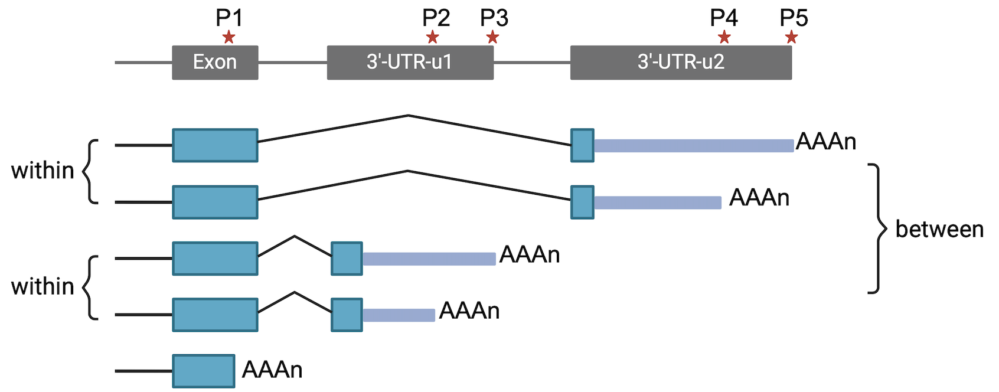
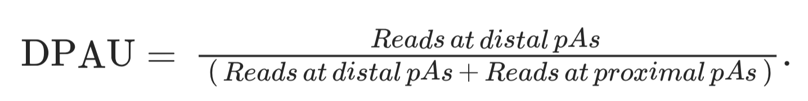

# Step 4. Differential analysis



## PAS usage index

For genes with two polyA sites, we used DPAU to quantify the percentage of DPAU for each gene. DPAU ranges from 0 to 1.



For genes with more than two polyA sites, [gDPAU](https://www.pnas.org/doi/10.1073/pnas.2113504119) is used to quantify the trend of distal polyA site usage for each gene. It is a location index weighted sum of read count percentage of gene's each polyA site. E.g., for a gene with n (n≥2) polyA sites, p1, p2, ..., pn represent the percentages of its polyA site usage at each site from 5′-end to 3′-end.


When n = 2, gDPAU = DPAU.

**Reference:**

[Wang J, Chen W, Yue W, et al. Comprehensive mapping of alternative polyadenylation site usage and its dynamics at single-cell resolution[J]. Proceedings of the National Academy of Sciences, 2022, 119(49): e2113504119.](https://www.pnas.org/doi/abs/10.1073/pnas.2113504119)

## 4.1. With replicates

``` shell
lrapa diff -i test.PAS.count.txt -s sample.txt -c case -n control
```

This module performs differential APA usage analyses between exactly two conditions with two or more replicates based the R package [DRIMSeq](http://bioconductor.org/packages/release/bioc/html/DRIMSeq.html). This is done by testing if the ratio of APA changes between conditions.

If a gene's absolute mean difference of DPAU/gDPAU is \>0.1 and adjusted *P* value is \< 0.01 between two groups, the gene's APA change between two groups will be deemed as significant.

**Parameters**

-   `-i, --input`: count file of PAS sites (required).
-   `-s, --sample`: sample information (required).
-   `-c, --group1`: group1 for differential analysis (required).
-   `-n, --group2`: group2 for differential analysis (required).

Example file of sample information

| sample_id,group |
|:---------------:|
|     N1,case     |
|     N2,case     |
|     N3,case     |
|   C1,control    |
|   C2,control    |
|   C3,control    |

## 4.2. No replicates

This module performs differential APA usage analyses between exactly two conditions with no replicate based chisq test. For each test, a n × 2 matrix per PAS site was generated, with the n polyA forming rows and read count in the two conditions forming columns.

We used a Benjamini--Hochberge correction for multiple testing.

If a gene's absolute mean difference of DPAU/gDPAU is \>0.3 and adjusted *P* value is \< 0.01 between two groups, the gene's APA change between two groups will be deemed as significant.

``` shell
lrapa norepdiff -c test.PAS.count.txt -n N1 -g C1
```

**Parameters**

-   `-i, --input`: count file of PAS sites (required).

-   `-c, --group1`: sample 1 for differential analysis (required).

-   `-n, --group2`: sample 2 for differential analysis (required).

    **Note:** The name of sample must same as in the count file.